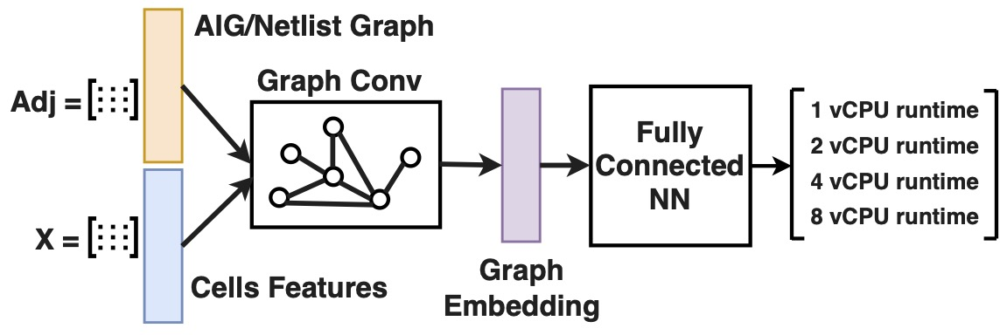

# Prediction

In this part, we build a runtime prediction model based on Graph Convolutional Network. 
The model takes as input a graph represnetation of the design.
In this work, we use [Deep Graph Library](https://www.dgl.ai/) to build the model.
Below, we provide instructions for testing out the training process of our model.




## Setup

First, install the dependencies of the model.

```Shell
virtualenv .venv --python=python3
source .venv/bin/activate
pip install -r requirements
```

## Processing Input Designs as Graphs

The first step is that to parse an input design as graph representation suitable for the `dgl` library.
There are two different graphs that we operate on: a desing in RTL, and a design in netlist format. 

We provide sample data in the [data](./data) folder. 
You may skip this section if you just want to try out our model.
However, if you want to use it on your own dataset, we provide the details below.

### RTL Designs

First, install [Yosys] and make sure that both `yosys` and `yosys-abc` commands are available on your `$PATH` (i.e. you can call them from directory).

The file [aig.py](aig.py) provides wrappers around this functuonality. It uses `yosys` to read a verilog in RTL format and convert it to and AIG graph.
From the AIG graph, we construct a `dgl` graph.
Below is the high-level function that you can use to build your own graphs.

```Python
from aig import read_verilog

G = read_verilog('/path/to/design.v')
```
where `G` is a graph representation in `dgl` format. You may save this graph in a binary file for future loading (similar to how we provided the data directory) using:

```Python
from dgl.data.utils import save_graphs

save_graphs("./design.dgl", [G], {})
```

### Netlist Designs

NOTE :exclamation: 

> Parsing netlists depends on the python package `opendbpy`. This package is only compiled for CentOS 7.

First, install `opendbpy` using `pip install opendbpy`.

The file [netlist.py](netlist.py) provides wrappers around this functionality. It basically uses `opendbpy` to parse LEF and DEF files (standard formats for representing netlists). Then, it constucts a `dgl` graph using a star model (converting each net into directed edges from the driving cell to the sinks).
Below is the high-level function that you can use to build up your graphs.

```Python
from netlist import read_netlist

G = read_netlist('/path/to/libary.lef', '/path/to/design.def')
```

where `G` is a graph representation in `dgl` format. Similarly, you may save this graph in a binary file for future loading (similar to how we provided the data directory) using:

```Python
from dgl.data.utils import save_graphs

save_graphs("./design.dgl", [G], {})
```

## Dataset

We provide a dataset for pre-processed designs in [data/dgl.zip](./data/dgl.zip). 
Each file has a name and an ID that represents the design itself. 

In addition, we provide the runtimes on 8 vCPUs in [data/train.csv](./data/train.csv) and [data/test.csv](./data/test.csv) for training and testing datasets respectively.

This dataset is loaded in [train.py](train.py) file.

## Training

The model is defined in [model.py](model.py). 

To start the training loop, run:

```Shell
python train.py
```

To see all training options, run:

```Shell
python train.py --help
```

