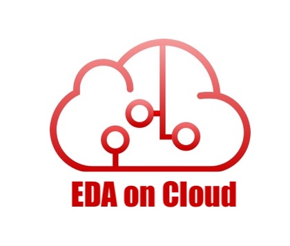
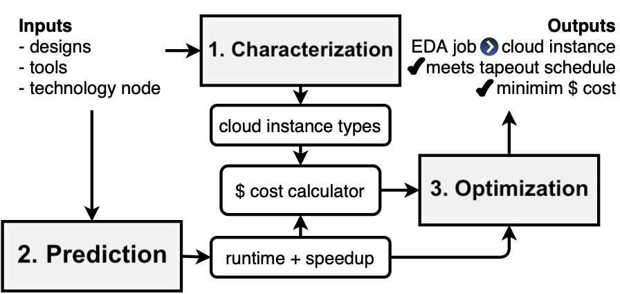

# Characterizing and Optimizing EDA Flows for the Cloud 

## Abstract

Design space exploration in logic synthesis and parameter tuning in physical design require a massive amount of compute resources in order to meet tapeout schedules. To address this need, cloud computing provides semiconductor and electronics companies with instant access to scalable compute resources. However, deploying EDA jobs on the cloud requires EDA teams to deeply understand the characteristics of their jobs in cloud environments. Unfortunately, there has been little to no public information on these characteristics. Thus, in this paper, we first formulate the problem of moving EDA jobs to the cloud. To address the problem, we characterize the performance of four EDA main applications, namely: synthesis, placement, routing and static timing analysis. We show that different EDA jobs require different compute configurations in order to achieve the best performance. Using observations from our characterization, we propose a novel model based on Graph Convolutional Networks to predict the total runtime of a given stage on different configurations. Our model achieves a prediction accuracy of 87%. Furthermore, we present a new formulation for optimizing cloud deployments in order to reduce costs while meeting deadline constraints. We present a pseudo-polynomial optimal solution using a multi-choice knapsack mapping that reduces deployment costs ($) by 35.29%. 

## Structure

This repository is divided into three parts:

* [Characterization](1_characterization): this folder contains run scripts and visualizations done for our characterization study.
* [Prediction](2_prediction): this folder contains the GCN-based model for predicting the runtimes.
* [Optimization](3_optimization): this folder contains an implementation of the multi-choice knapsack algorithm that optimizes EDA deployments.

## License
BSD 3-Clause License. See [LICENSE](LICENSE) file.
